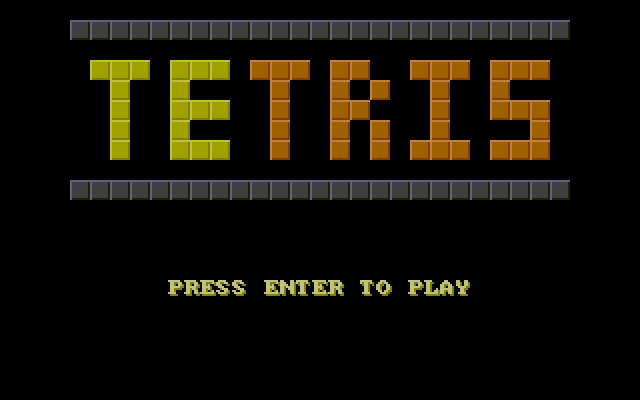
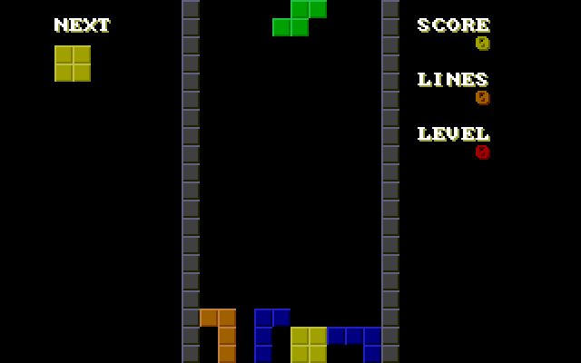
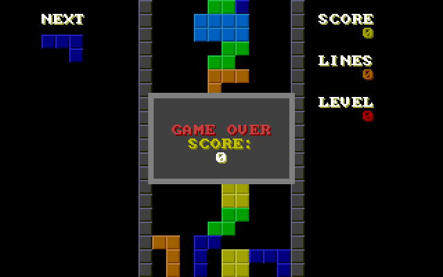

# TETRIS-OS, in Rune

An operating system that only plays Tetris: [jdah's
TETRIS-OS](https://github.com/jdah/tetris-os) (MIT — see `LICENSE`), ported
from C to Rune file for file, from its own boot sector up. 32-bit x86, its own
bootloader, a SoundBlaster 16 driver playing the Tetris theme in four parts,
and double-buffered 320x200 graphics with an 8-bit RRRGGGBB palette.





```sh
rune run              # build it, make the disk image, boot it in QEMU
rune run --release
```

Needs `qemu-system-i386`, an objcopy (LLVM's, `i686-elf-objcopy`, or the
system's), and either clang and ld.lld (the default) or a GNU cross
toolchain: `rune run --target i686-elf` builds with `i686-elf-gcc` and
`i686-elf-ld` instead. It
works from anywhere in this directory. `rune build` links the kernel as an ELF
file, the boot sector inside it; `build.rune`, the package's build script,
then lays that out as a disk image — each section at its load address — and
tells `rune run` to boot the image rather than the ELF file. Enter starts a
game; the arrow keys move, `a` and `d` (or `r`) rotate, space drops, `m`
toggles the music. QEMU is started with a SoundBlaster 16 and no audio output;
to hear it, change `-audiodev none` in `Rune.toml` to `pa` (PulseAudio) or
`coreaudio`.

## What is where

| Original | Here | Is |
| --- | --- | --- |
| `stage0.S` | `boot/stage0.S` | the boot sector: loads the kernel, mode 13h, A20, protected mode |
| `start.S` | `boot/start.S` | `_start`, and the 48 interrupt entry stubs |
| `link.ld`, `Makefile` | `link.ld`, `Rune.toml`, `build.rune` | the boot sector as sector 0 of the disk, the kernel from sector 1 |
| `util.h` | `src/port.rune` | I/O ports and the interrupt flag, over `std::asm` |
| `idt.c` | `src/idt.rune` | the IDT, and `lidt` |
| `isr.c` | `src/isr.rune` | installing the stubs; `isr_handler` |
| `irq.c` | `src/irq.rune` | the PICs, remapped |
| `timer.c` | `src/timer.rune` | the PIT at 363 Hz |
| `keyboard.c` | `src/keyboard.rune` | scancodes to keys and characters |
| `fpu.c`, `math.c` | `src/fpu.rune`, `src/math.rune` | the x87, `fsin` |
| `screen.c`, `font.c` | `src/screen.rune`, `src/font.rune` | mode 13h, double-buffered; the 8x8 font |
| `sound.c`, `music.c` | `src/sound.rune`, `src/music.rune` | the SB16 by DMA; the theme |
| `speaker.c` | `src/speaker.rune` | the PC speaker, unused, as in the original |
| `system.c` | `src/system.rune` | `rand`, and the red panic screen |
| `main.c` | `src/main.rune` | the game |
| — | `src/serial.rune` | a log on COM1, so a test can hear the kernel |

Two parts stay assembly, because no Rune function can be where they are: the
boot sector runs in 16-bit real mode, and an interrupt stub runs before there
is a Rune frame to run in and returns with `iret`. Everything they call is
Rune.

## Built with every check on

The kernel is built `#runtime(none)` with `safety = "full"`: every array
index is checked, every integer operation that can overflow is checked, and
the Zombie borrow checker proves every borrow. A failed check reaches the
kernel's `#panicHandler`, which does what the original's `panic` did — a red
screen with the message on it — and logs where on the serial port.

Porting it turned up six bugs in the original, each silent in C — most
caught by those checks, the rest by reading the code closely enough to
translate it:

- **The keyboard wrote past an array.** `keyboard.chars` held 128 entries,
  but the function keys and Home, End, Insert, Delete and the page keys make
  character codes from 128 to 149. Pressing F1 wrote past its end. Here that
  write is a checked index; the array holds 256.
- **Level 29 froze.** `FRAMES_PER_STEP` was declared with 30 entries and
  given 29, so the last read as 0; the step counter, decremented before it
  was compared with zero, never came round again, and at level 29 a piece
  never fell. A Rune array literal cannot be shorter than its type.
- **The random number generator overflowed on purpose.** `x *= 23786259 -
  rseed` relies on wrapping. Under `--safety full` a plain `*` that
  overflows panics, so it says `$wrappingMul`, and means it.
- **Two exceptions had no name.** `exceptions[32]` listed 30, so exception
  30 or 31 would have panicked with a null message and a blank red screen.
  The table here has all 32, and a table one short would not compile.
- **Shift never did anything.** `KEY_CHAR` asked whether Shift was held by
  testing the modifier bit against the *scancode*, which never has it, so
  the shifted layout was never used. Here it is looked up from the modifier
  state.
- **The second PIC was never acknowledged.** `irq.c` sent its
  end-of-interrupt only from interrupt 0x40, which no line reaches — lines 8
  to 15 are 40 to 47. Harmless here, since nothing uses them; fixed anyway.
  So is `irq_set_mask`'s `1 << i` for a line past 7.

Where the port knowingly differs:

- `fmod` is `x - m * trunc(x / m)` in Rune rather than an `fprem` loop in
  assembly.
- The SB16's DMA buffer is checked not to cross a 128 KB boundary, which the
  original left to where the linker happened to put it.
- The serial log is new.

As in the original, starting a game clears every flag in the game state —
the music flag included — so the first `m` after a game starts turns the
music "on", which it already was.

The keyboard is read once a frame, as in the original, so a key has to be
held for longer than a frame (a thirtieth of a second) to be seen. A person
always does; QEMU's `sendkey` by default does not, which is why the test
holds each key for a few hundred milliseconds.

## How it is checked

`tests/bare_metal_test.py` (CTest `rune_bare_metal`) builds it, boots it
headless under QEMU with the monitor on a socket, and reads the serial log
and screen dumps: it boots through its own boot sector into Rune, finds the
SoundBlaster 16, builds the four parts of the theme with the original's note
counts (62, 195, 128, 58), draws the menu, starts a game on Enter, fills the
board with hard drops until the game ends, and shows the GAME OVER box —
with nothing panicking on the way.
